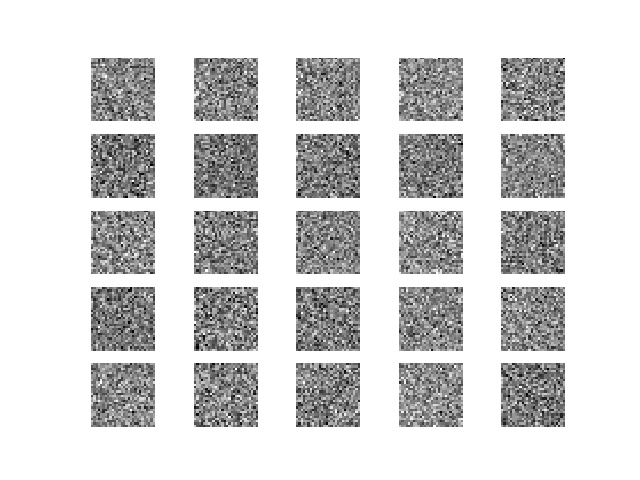
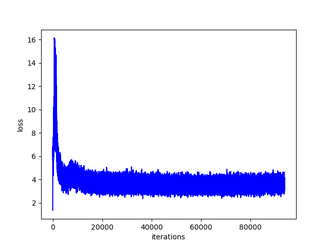
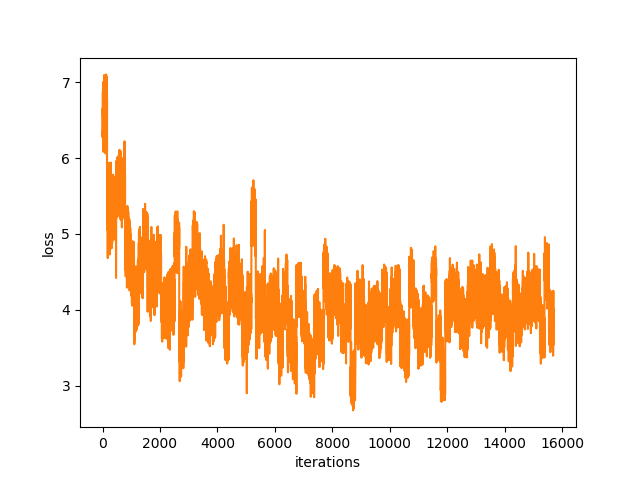

# Generative Adversarial Nets

## Introudction

Keras implementation of *Generative Adversarial Networks* with a multilayer perceptron generator and discriminator.

[Code](gan.py)

Paper: [Ian J. Goodfellow et al. *Generative Adversarial Nets*](https://arxiv.org/abs/1406.2661)

## Tricks

- Added Batch Normalization after each Dense layer in both generator and discriminator, except for the last one, to reduce the possibility that the generator callopse into certain classes.
- LeakyReLU in both generator and discriminator.
- One-sided smooth.

## Details

### Results

### Discriminator loss

### Generator loss

### Validation loss

## Limitations

- As description in the paper, the update of discriminator needs to be synchronized well with the update of generator. Otherwise, the results would tend to collapse. (Generator only recover a small part of real data distribution).
- Convergence is a problem.