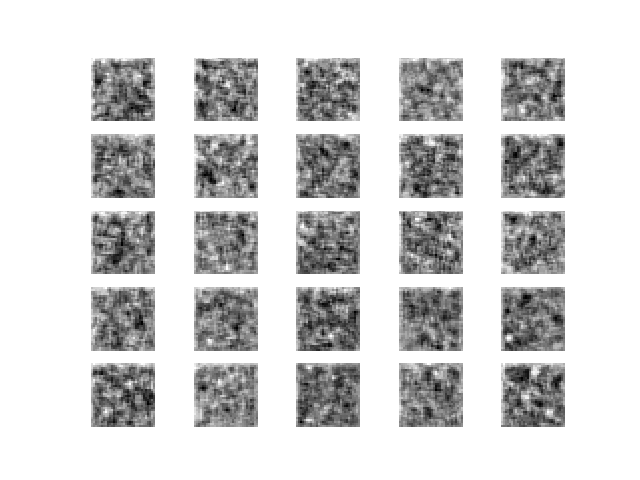
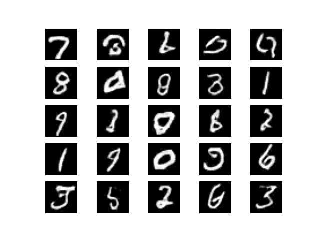
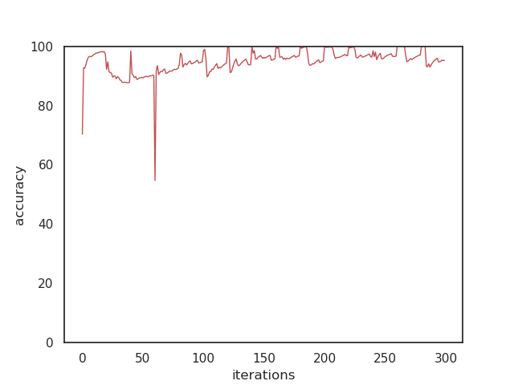
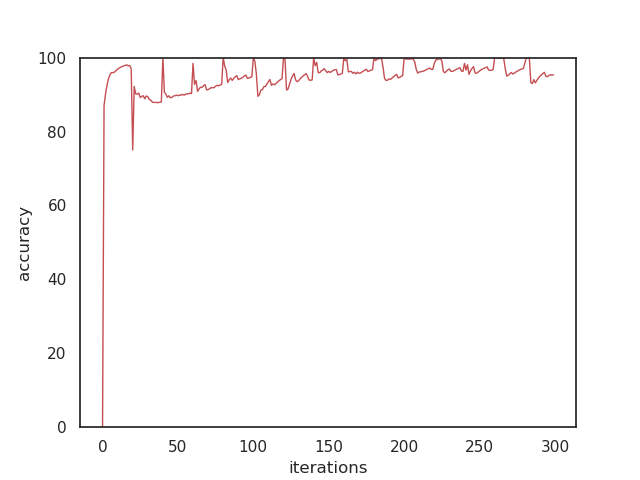
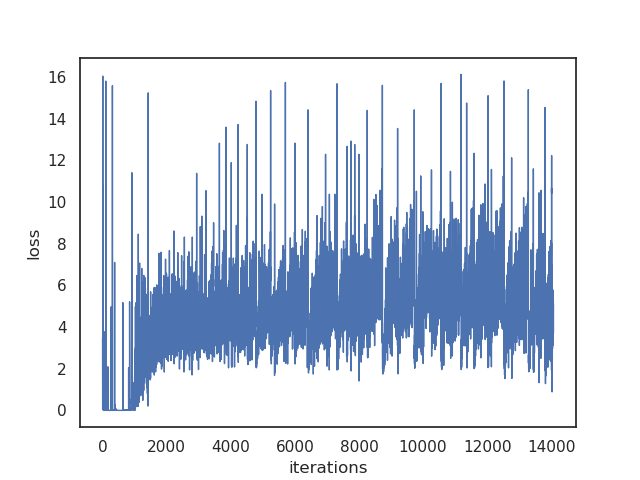
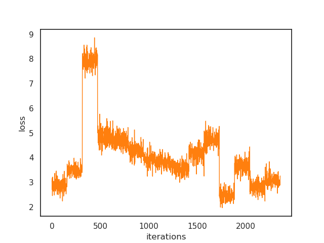
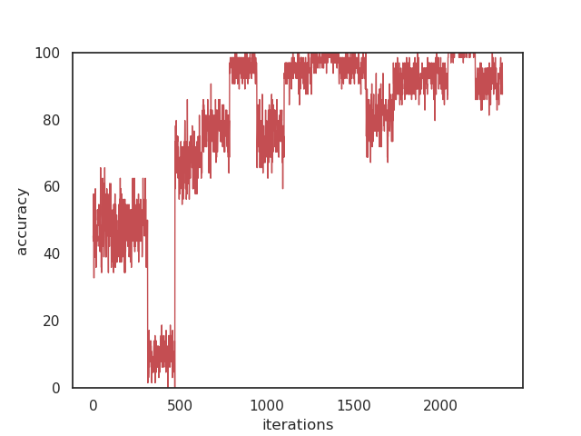
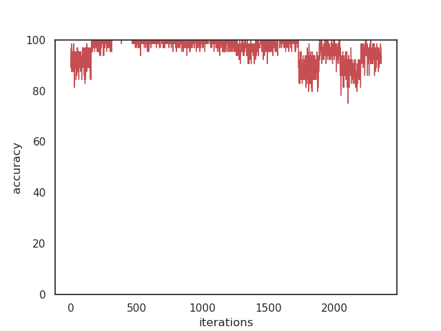

# Self-Attention GAN

## Introudction

Keras implementation of Self-Attention GANs.

[Code](sagan.py)

Paper: [Ian J. Goodfellow et al. *Self-Attention Generative Adversarial Networks*](https://arxiv.org/abs/1805.08318)

## Update Status

 * [ ] Attention Visualization
 * [ ] Add keras implementation of spectral normlization (a little bit tricky)
 * [ ] Generate Cifar10 and ImageNet images

## Details

### MINIST

#### Training Process

Results gif during training.  

#### Results
Results after training 15 epochs.  

### Discriminator loss

Plot of training discriminator fake samples loss.  

Plot of training discriminator real samples loss.  

### Discriminator accuracy

Training real samples acc.  

Training fake samples acc.  

### Generator loss

Plot of training generator loss.  

### Validation loss

Plot of validation generator loss.  

### Validation accuracy

Validation real samples acc.  

Validation fake samples acc.  

