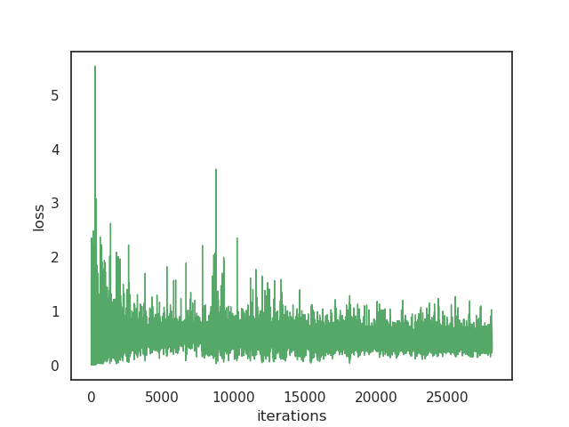
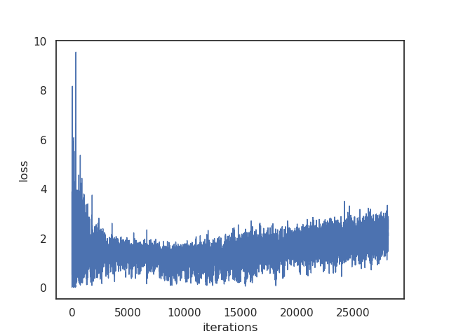
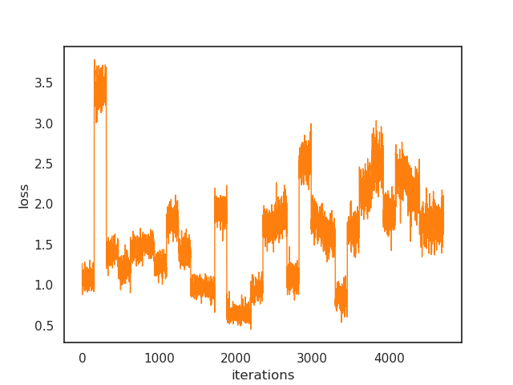

# DCGAN

## Introudction

Keras implementation of a Deep Convolutional GAN model to generate MNIST and Cifar10 images.

[Code](dcgan.py)

Paper: [Alec Radford et al. *Unsupervised Representation Learning With Deep Convolutional Generative Adversarial Networks*](http://arxiv.org/abs/1511.06434)

## Tricks
### As described in the paper

- Use fully convolutional net, which replace spatial pooling functions with strided convolutions, allowing the network to learn its own spatial downsampling.
- Eliminating fully connected layers on the top of convolutional features.
- Batch Normalization, whichi stabilizes learning by normalizaing the input to each unit to have zero mean and unit variance. Directly appliying batchnorm to all layers, however, results in sample oscillation and model instability. This was avoided by not applying batchnorm to the generator output layer and the discriminator input layer.

### Additional tricks
- ReLU activation for the generator, except for the last layer, which use tanh or sigmoid (depends on data normalization). LeakyReLU is used for discriminator.
- One-sided smooth.

## Details

### Results

### Discriminator loss

### Discriminator accuracy

### Generator loss

### Validation loss

