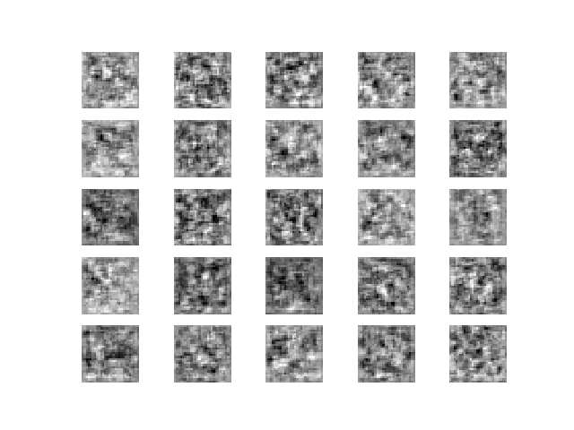
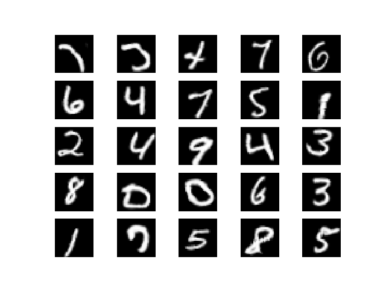

# DCGAN

## Introudction

Keras implementation of a Deep Convolutional GAN model to generate MNIST and Cifar10 images.

[Code](dcgan.py)

Paper: [Alec Radford et al. *Unsupervised Representation Learning With Deep Convolutional Generative Adversarial Networks*](http://arxiv.org/abs/1511.06434)

## Tricks
### As described in the paper

- Use fully convolutional net, which replace spatial pooling functions with strided convolutions, allowing the network to learn its own spatial downsampling.
- Eliminating fully connected layers on the top of convolutional features. (Added a fully connected layer at the discriminator to ensure good results.)
- Batch Normalization, whichi stabilizes learning by normalizaing the input to each unit to have zero mean and unit variance. Directly appliying batchnorm to all layers, however, results in sample oscillation and model instability. This was avoided by not applying batchnorm to the generator output layer and the discriminator input layer.

### Additional tricks
- ReLU activation for the generator, except for the last layer, which use tanh or sigmoid (depends on data normalization). LeakyReLU is used for discriminator.
- One-sided smooth.

## Details

### Training process
Results gif during training.  

### Results
Results after training 30 epochs.  

### Discriminator loss
Plot of training discriminator loss.  

### Discriminator accuracy
Training real samples acc.  

Training fake samples acc.  

### Generator loss
Plot of training generator loss.  

### Validation loss
Plot of validation generator loss.  

### Validation accuracy

real samples acc.  

fake samples acc.  

