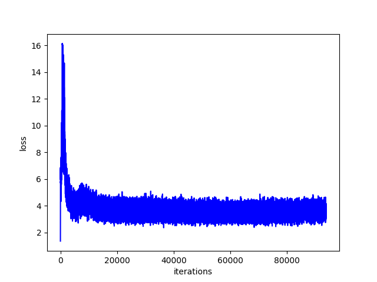

# Generative Adversarial Nets

## Intro

Implementation of *Generative Adversarial Networks* with a multilayer perceptron generator and discriminator

[Code](gan/gan.py)

Paper: [Ian J. Goodfellow et al. *Generative Adversarial Nets*](https://arxiv.org/abs/1406.2661)

## Details

### Results

	

### Discriminator loss

### Generator loss

### Validation loss

## Limitations

- As description in the paper, the update of discriminator needs to be synchronized well with the update of generator. Otherwise, the results would tent to collapse. (Generator only recover a small part of $p_{data}$)
- From the results, the models clearly collapsed (to 7 and 9). One can improve the performance by incresing k in the update of the discriminator.